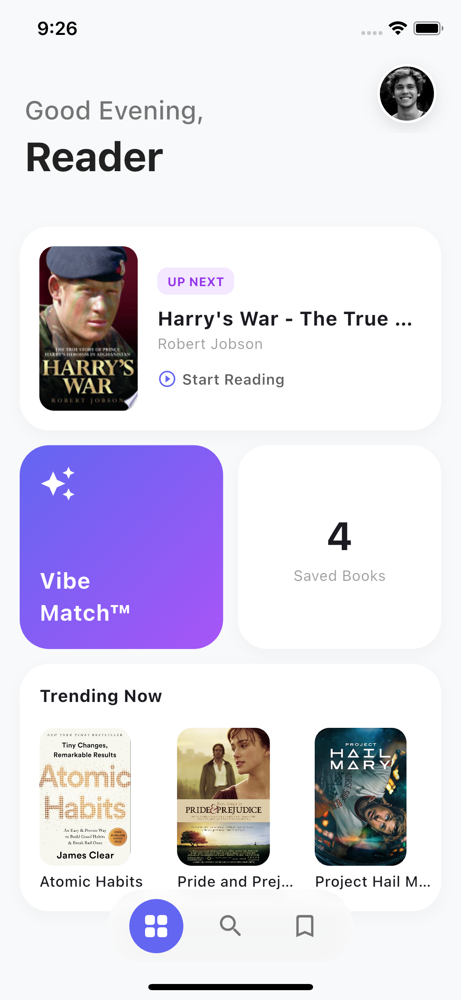
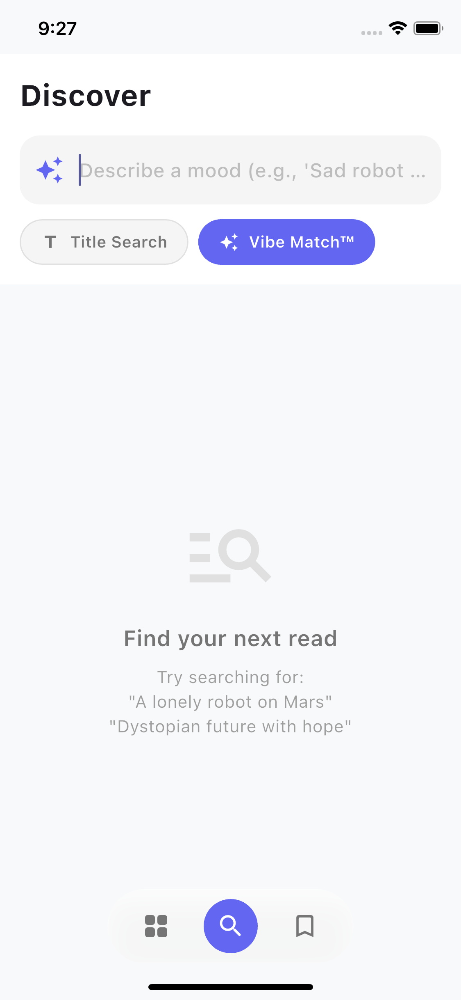
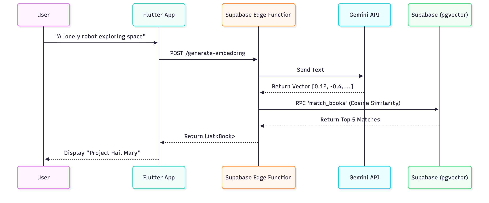

# Libri AI 📚✨


> **A semantic book recommender engine powered by Flutter, Supabase Vector Search, and Google Gemini.**

Libri AI goes beyond keyword search by understanding the *context* and *vibe* of a user's query using **Vector Embeddings**.

| **Home Dashboard (Bento)** | **AI Vibe Search** |
|:---:|:---:|
|  |  |
| *Staggered Grid & Glassmorphism* | *Natural Language Semantic Search* |

---

## 🏗 System Architecture

This project follows a strict **Clean Architecture** to ensure scalability and testability, separating the code into `Data`, `Domain`, and `Presentation` layers.

### The AI Pipeline
Below is the high-level data flow for the "Vibe Match" feature:



### Tech Stack

| Component | Technology | Reasoning |
| :--- | :--- | :--- |
| **Framework** | **Flutter** (3.24) | Cross-platform, high-performance rendering. |
| **State** | **Riverpod 2.0** | Compile-safe dependency injection & state management. |
| **Backend** | **Supabase** | Managed PostgreSQL with `pgvector` extension. |
| **AI Model** | **Gemini** | `text-embedding-004` model for high-fidelity vectors. |
| **Routing** | **GoRouter** | Deep linking and declarative navigation. |
| **Local DB** | **Hive** | Offline caching for standard title searches. |

---

📂 Project Structure
--------------------

```
lib/
├── main.dart                   # Entry point & App Bootstrap
├── src/
│   ├── core/                   # App-wide configs
│   │   ├── router/             # GoRouter Configuration
│   │   ├── theme/              # AppTheme & Palettes
│   │   └── utils/              # Extensions & Constants
│   └── features/
│       ├── books/              # Domain: Book Entities
│       │   ├── data/           # Repositories & DTOs
│       │   ├── domain/         # Freezed Models
│       │   └── presentation/   # Detail Screens & "Add Book" Form
│       ├── home/               # Feature: Dashboard
│       │   └── presentation/   # BentoGrid & Saved Books
│       └── search/             # Feature: AI Search
│           └── presentation/   # Search Logic & UI

```

* * * * *

🚀 Getting Started
------------------

### Prerequisites

-   Flutter SDK `^3.5.0`

-   Supabase Account (with `pgvector` enabled)

-   Gemini API Key

### Installation

1.  **Clone the repo**

    Bash

    ```
    git clone [https://github.com/Nei1eveN/libri_ai.git](https://github.com/Nei1eveN/libri_ai.git)
    cd libri_ai

    ```

2.  Setup Environment

    Create a .env file in the root directory:

    Code snippet

    ```
    SUPABASE_URL=https://your-project.supabase.co
    SUPABASE_ANON_KEY=your-anon-key
    GEMINI_API_KEY=your-gemini-key

    ```

3.  **Run the App**

    Bash

    ```
    flutter pub get
    flutter run

    ```

* * * * *

🧠 How It Works
---------------

1.  **Ingestion:** When a book is added, an Edge Function calls Gemini to convert the description into a **768-dimensional vector**.

2.  **Storage:** This vector is stored in a `vector` column in PostgreSQL.

3.  **Retrieval:** When a user searches, their query is also vectorized. We use **Cosine Similarity** (`<=>`) to find vectors that point in a similar direction in the multi-dimensional space.

SQL

```
-- The core logic used in Supabase
select title, 1 - (embedding <=> query_embedding) as similarity
from books
where 1 - (embedding <=> query_embedding) > 0.25
order by similarity desc;

```

* * * * *

🔮 Future Roadmap
-----------------

While the MVP demonstrates the core "Vibe Match" architecture, the following features are planned for v2.0:

-   **🤖 Chat with Books (RAG):** Implement Retrieval-Augmented Generation to allow users to ask specific questions about a book's plot.

-   **☁️ Lazy Auth & Sync:** Allow anonymous usage with a "Sign Up to Sync" feature that migrates local Hive data to Supabase.

-   **⚡ Performance:** Implement cursor-based pagination for the "Trending" feed to handle datasets of 10,000+ books.

-   **📸 ISBN Scanner:** Integrate `mobile_scanner` to let users scan physical books and generate AI recommendations instantly.

* * * * *

*Built with 💙 by Neil Patrick Potot*